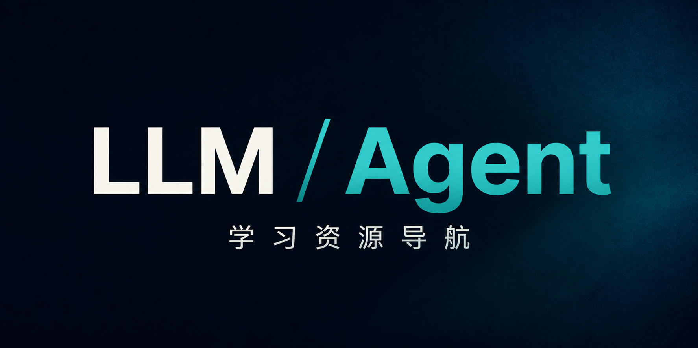

  

# LLM / Agent 学习资源导航

这是一份面向中文开发者的 LLM / RAG / Agent 学习教程清单，目标很简单：帮你更快找到值得学、适合自己当前阶段的资料。

- 适合谁：想系统补基础、想尽快跑通应用、想做 RAG / Agent 工程实践的人
- 如何使用：先看最符合你当前目标的分组，再根据 `简介` 和 `适合谁 / 推荐理由` 选择资源
- 热度说明：仅 GitHub 仓库资源显示 `⭐ Stars`，用于辅助判断社区热度；数据按每日自动同步更新

## 🧠 想先把 LLM 基础学明白

如果你还在补大模型原理、Transformer、预训练、推理机制这些基础，先从这一组开始。

| 资源 | 简介 | 适合谁 / 推荐理由 |
| --- | --- | --- |
| [Happy-LLM](https://github.com/datawhalechina/happy-llm) ⭐ Stars：31.6k| 中文友好的系统教程，覆盖大模型核心原理与实践。 | 适合谁：想系统理解 Transformer、预训练和推理机制的人。 推荐理由：适合作为大模型原理主线教材。 |
| [LLMBook](https://github.com/datawhalechina/llmbook) ⭐ Stars：140| 偏教材化、体系化的大模型资料。 | 适合谁：希望系统补课、需要一本中文手册型资料的人。 推荐理由：适合查漏补缺和构建知识地图。 |
| [llms-from-scratch-cn](https://github.com/datawhalechina/llms-from-scratch-cn) ⭐ Stars：4.2k| 从 0 到 1 实现一个大模型的中文项目。 | 适合谁：代码基础较好、想深入底层机制的人。 推荐理由：能帮助你从实现角度理解模型结构和训练逻辑。 |
| [Hugging Face LLM Course](https://huggingface.co/huggingface-course) | 面向 NLP 与模型基础的公开课程。 | 适合谁：想系统补理论和 Hugging Face 生态知识的人。 推荐理由：结构清晰，适合和中文资料互补。 |

## ⚡ 想尽快把开源模型和应用跑起来

如果你更关心“先跑通、先做出东西”，优先看这组，能更快从概念进入实践。

| 资源 | 简介 | 适合谁 / 推荐理由 |
| --- | --- | --- |
| [self-llm](https://github.com/datawhalechina/self-llm) ⭐ Stars：31.1k| 面向中文开发者的开源大模型部署、微调与使用实战教程。 | 适合谁：想尽快把本地或开源模型跑起来的人。 推荐理由：上手导向强，适合从“先跑通”切入大模型实践。 |
| [llm-universe](https://github.com/datawhalechina/llm-universe) ⭐ Stars：13.3k| 面向应用开发者的大模型实践项目，包含知识库与应用搭建路线。 | 适合谁：想快速搭建大模型应用的人。 推荐理由：适合从“跑通应用”视角切入 RAG 和应用开发。 |
| [OpenAI Responses API](https://platform.openai.com/docs/api-reference/responses/create?api-mode=responses) | 当前 OpenAI 的核心生成式接口文档。 | 适合谁：想理解现代模型接口、多模态和结构化输出的人。 推荐理由：能帮助你把基础认知连接到实际 API 使用。 |

## 📚 想做 RAG / 企业知识库

如果你的目标是文档问答、企业知识库、检索增强生成或者更稳定的问答系统，这一组最值得先看。

| 资源 | 简介 | 适合谁 / 推荐理由 |
| --- | --- | --- |
| [all-in-rag](https://github.com/datawhalechina/all-in-rag) ⭐ Stars：9.0k| 面向 RAG 的中文系统教程，覆盖理论、实践和工程化。 | 适合谁：想做企业知识库、内部问答、文档问答系统的人。 推荐理由：中文资料里覆盖面较完整，实用性强。 |
| [OpenAI Cookbook - File Search RAG](https://cookbook.openai.com/examples/file_search_responses) | 基于文件检索能力的官方 RAG 示例。 | 适合谁：想快速理解文件检索型 RAG 的人。 推荐理由：示例贴近当前主流 API 能力，适合作为现代 RAG 参考。 |
| [Building and Evaluating Advanced RAG](https://www.deeplearning.ai/courses/building-evaluating-advanced-rag) | 聚焦高级 RAG 与评测方法的短课。 | 适合谁：已经做过基础 RAG，想提升稳定性和效果的人。 推荐理由：补上“怎么评估和优化”的关键能力。 |
| [Retrieval Augmented Generation (RAG)](https://www.deeplearning.ai/courses/retrieval-augmented-generation-rag) | 从检索、向量库、Prompt 到评测的系统课程。 | 适合谁：想完整学习 RAG 全流程的人。 推荐理由：适合建立更完整的工程化视角。 |
| [LangChain RAG Tutorial](https://docs.langchain.com/oss/python/langchain/rag) | 用 LangChain 构建 RAG 应用的官方教程。 | 适合谁：准备上手框架构建 RAG 原型的人。 推荐理由：有助于从概念过渡到框架实践。 |
| [Building Agentic RAG with LlamaIndex](https://www.deeplearning.ai/courses/building-agentic-rag-with-llamaindex/) | 围绕 Agentic RAG、Router 和 Tool Calling 的课程。 | 适合谁：想让 RAG 系统具备更主动决策能力的人。 推荐理由：适合作为 RAG 到 Agent 的过渡材料。 |

## 🤖 想学 Agent / Workflow

如果你准备进入工具调用、工作流编排、多 Agent 协作或产品化 Agent 系统，这一组最实用。

| 资源 | 简介 | 适合谁 / 推荐理由 |
| --- | --- | --- |
| [hello-agents](https://github.com/datawhalechina/hello-agents) ⭐ Stars：62.1k| 从 0 讲解 Agent 基本概念、范式和实战思路。 | 适合谁：想从零入门 Agent 的开发者。 推荐理由：适合作为 Agent 第一门中文课。 |
| [OpenAI Agents Guide](https://platform.openai.com/docs/guides/agents) | 讲清楚 Agent 的模型、工具、知识与控制流。 | 适合谁：想建立现代 Agent 官方视角的人。 推荐理由：概念准，适合作为实践前的统一参照。 |
| [OpenAI Agents SDK](https://platform.openai.com/docs/guides/agents-sdk/) | OpenAI Agent 开发 SDK 文档。 | 适合谁：准备真正编写 Agent 代码的人。 推荐理由：适合把概念落到实际实现。 |
| [LangGraph](https://github.com/langchain-ai/langgraph) ⭐ Stars：35.9k| 适合复杂、可控、可恢复的 Agent 工作流编排框架。 | 适合谁：要做多步骤、生产级 Agent 的团队。 推荐理由：当前 Agent 工作流领域的重要框架。 |
| [AutoGen](https://github.com/microsoft/autogen) ⭐ Stars：59.3k| 微软推出的多 Agent 编程框架。 | 适合谁：研究型、多角色协作型场景。 推荐理由：适合探索协同式 Agent 设计。 |
| [CrewAI](https://github.com/crewAIInc/crewAI) ⭐ Stars：54.4k| 强调角色分工和任务协作的多 Agent 框架。 | 适合谁：想快速组织多个角色 Agent 的开发者。 推荐理由：概念清晰，适合任务拆分类场景。 |
| [Dify](https://github.com/langgenius/dify) ⭐ Stars：146.7k| 开源 LLM 应用开发平台，支持工作流、RAG 和 Agent。 | 适合谁：想快速做产品原型、低代码搭建应用的人。 推荐理由：适合团队协作与快速产品化。 |

## 🎓 想系统跟课程学习

如果你更喜欢“跟着课程学”，这一组更适合按章节推进，建立稳定的学习节奏。

| 资源 | 简介 | 适合谁 / 推荐理由 |
| --- | --- | --- |
| [Microsoft Generative AI for Beginners](https://github.com/microsoft/generative-ai-for-beginners) ⭐ Stars：112.3k| 面向初学者的生成式 AI 系列课程。 | 适合谁：想从通识到应用建立整体认知的人。 推荐理由：课程组织清晰，适合做知识框架搭建。 |
| [ChatGPT Prompt Engineering for Developers](https://www.deeplearning.ai/courses/chatgpt-prompt-eng) | 经典 Prompt 工程入门短课。 | 适合谁：刚开始接触提示词与 LLM 应用开发的人。 推荐理由：短而实用，适合快速入门。 |
| [Hugging Face Agents Course](https://huggingface.co/learn/agents-course/en) | 系统化的 Agent 课程，覆盖多个工具链和实践任务。 | 适合谁：想系统学 Agent 的开发者。 推荐理由：内容完整，生态视角丰富。 |

## 🧭 想继续扩展视野 / 查找更多资料

如果你已经找到主线教程，想持续扩展框架、课程和资料池，可以从这一组往外发散。

| 资源 | 简介 | 适合谁 / 推荐理由 |
| --- | --- | --- |
| [Agent-Learning-Hub](https://github.com/datawhalechina/Agent-Learning-Hub) ⭐ Stars：4.3k| 中文社区中的 Agent 路线图与资源集合。 | 适合谁：希望优先看中文导航的人。 推荐理由：便于和本仓库形成互补。 |
| [Awesome-LLM](https://github.com/Hannibal046/Awesome-LLM) ⭐ Stars：27.0k| 大模型相关论文、课程、工具、框架和数据的综合清单。 | 适合谁：想系统扫全局生态的人。 推荐理由：覆盖面广，适合作为检索入口。 |
| [Awesome Agent Learning](https://github.com/artnitolog/awesome-agent-learning) ⭐ Stars：137| 专门面向 Agent 学习路径的课程与阅读列表。 | 适合谁：已经对 Agent 有兴趣，想持续扩展的人。 推荐理由：主题聚焦，适合做后续延展阅读。 |
| [Awesome AI Agents](https://github.com/brandonhimpfen/awesome-ai-agents) ⭐ Stars：11| 汇总 Agent 框架、平台、示例和学习资料。 | 适合谁：想快速了解 Agent 生态格局的人。 推荐理由：适合作为框架和案例导航。 |

## 补充说明

- 外部资源可能随时间失效、迁移、收费或内容变更，收录不代表对第三方内容的完全背书。
- 欢迎通过 Issue 或 PR 补充资源、修复链接或纠正文案。
- 本仓库内容采用 [CC BY 4.0](LICENSE) 许可协议。
